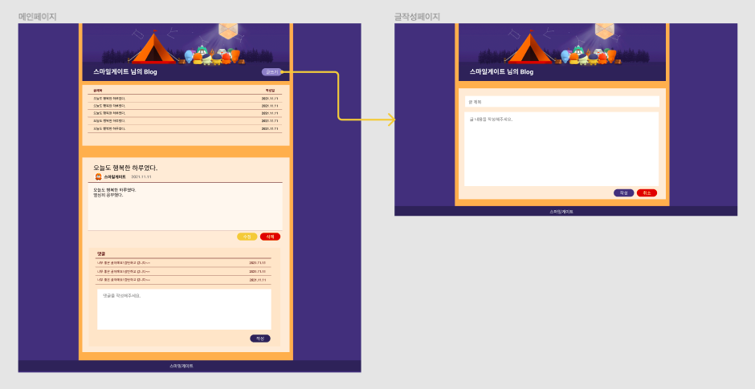
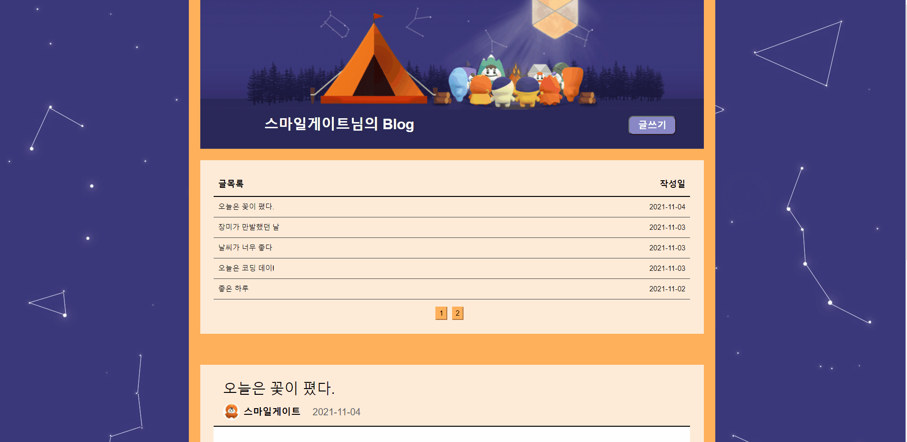
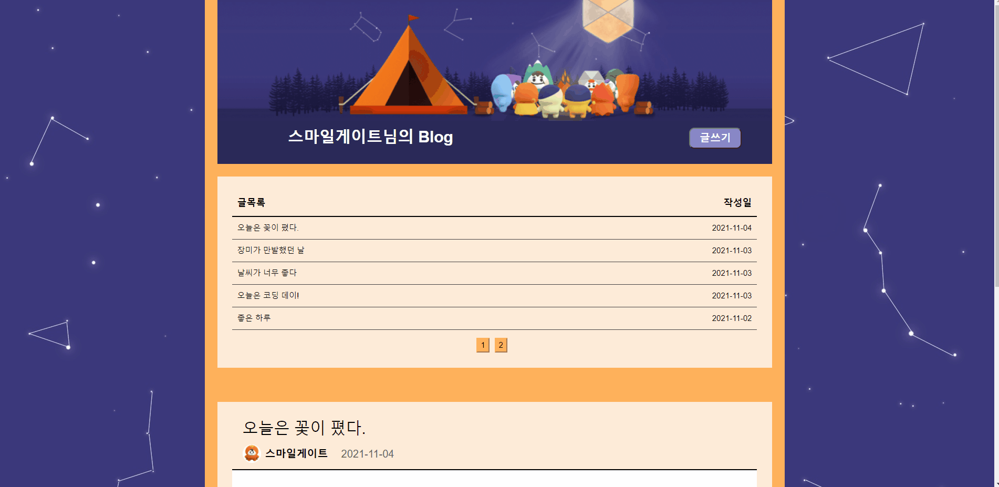
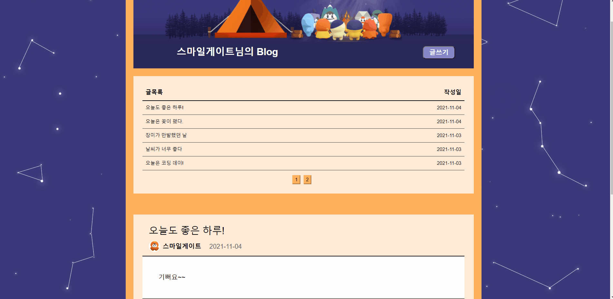
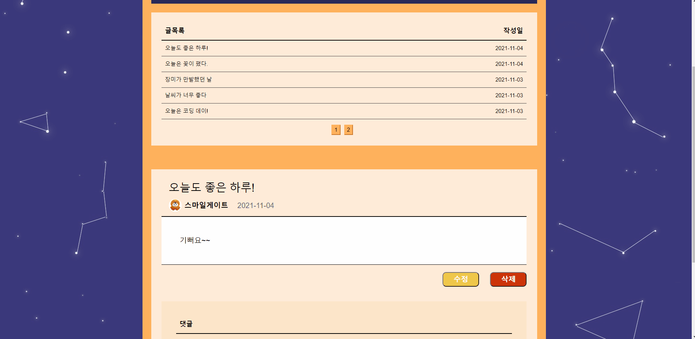
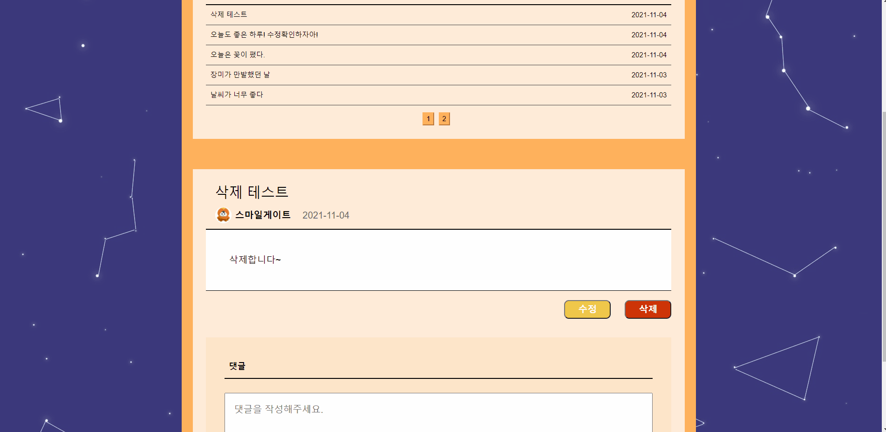
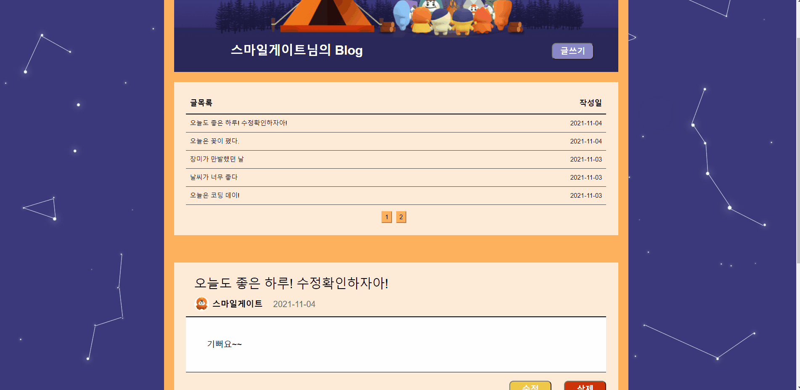

# 😀스마일게이트 1차 퀘스트

### 퀘스트 요구사항

✅  메인페이지 제작

✅  글 쓰기 수정 기능

✅ 글 목록 삭제 기능

✅  댓글 기능

✅  UI 디자인

### 프로토타입

> 심플하게 기능이 잘 보이면서도 스마일게이트의 느낌이 나도록 스마일게이트의 색채를 사용해 디자인했다.
>
> 메인페이지에서 글목록과 최근 작성글이 보이는 실제 블로그 형태를 차용하였다.

### 사용 기술

### 구현

1. 베너 

* 베너를 클릭하면 메인페이지로 이동한다.

2. 글 작성

* 글쓰기 버튼 클릭시 글 작성 페이지로 이동한다.
* 글 작성란에 글을 작성하고 작성 버튼을 클릭하면 글이 작성되면서 이전 페이지로 이동한다.
* 취소 버튼을 클릭하면 이전 페이지로 이동한다.

3. 작성한 글 목록 및 글

* 작성한 글 목록을 확인할 수 있다.

  5개씩 한 페이지에 보이도록 페이지네이션을 구현했다.

* 처음 홈페이지에 접속하면 최근 작성한 글이 보인다.
* 목록에서 선택시 해당 글이 보인다.

4. 글 수정

* 수정 버튼 클릭시 글 수정 페이지로 이동한다.
* 글 수정 페이지에서는 기존에 작성한 글이 보이면서 직접 수정할 수 있다.
* 작성 버튼 클릭시 글이 수정되면서 이전 페이지로 이동한다.
* 취소 버튼 클릭시 이전 페이지로 이동한다.

5. 글 삭제

* 삭제 버튼 클릭시 글이 삭제되고 메인페이지로 이동한다.

6. 댓글목록 및 댓글작성

* 상단의 글에 작성된 댓글 목록을 보여준다.
* 댓글 작성란에 글을 작성하고 작성 버튼을 클릭하면 댓글이 작성된다.

